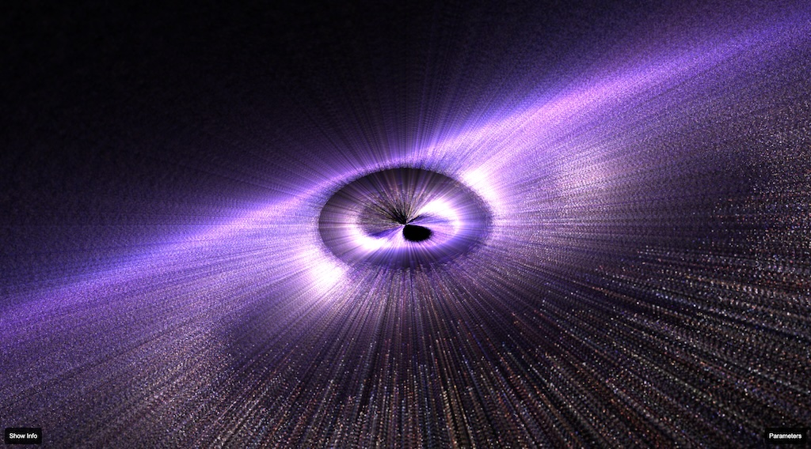

# intelligence.dev web site

This repository serves as the landing page for intelligence.dev featuring an interactive 3D galaxy simulation with physics-driven orbital mechanics.

## Features

- **Physics-driven orbital motion**: Stars follow Keplerian orbits with inner stars orbiting faster than outer stars
- **GPU-accelerated rendering**: Instanced star rendering with 10,000+ stars
- **Volumetric nebula effects**: Raymarched volumetric smoke and dust clouds
- **Real-time parameter controls**: Adjust galaxy properties including orbital speed, star count, and galactic radius

## Physics Implementation

The galaxy simulation uses accurate Keplerian orbital mechanics:
- Gravitational parameter GM ≈ 4.3×10⁻⁶ kpc³/s² (for ~10¹¹ solar masses)
- Angular velocity: ω = √(GM/r³)
- Each star maintains (r, θ₀, z) coordinates with GPU-computed orbital motion

Endless echoes drift,
Moments melt into the void,
Time, a distant dream.

  <picture>
    <source media="(prefers-color-scheme: dark)" srcset="./public/img/aeternis_preview.jpg">
    
  </picture>

