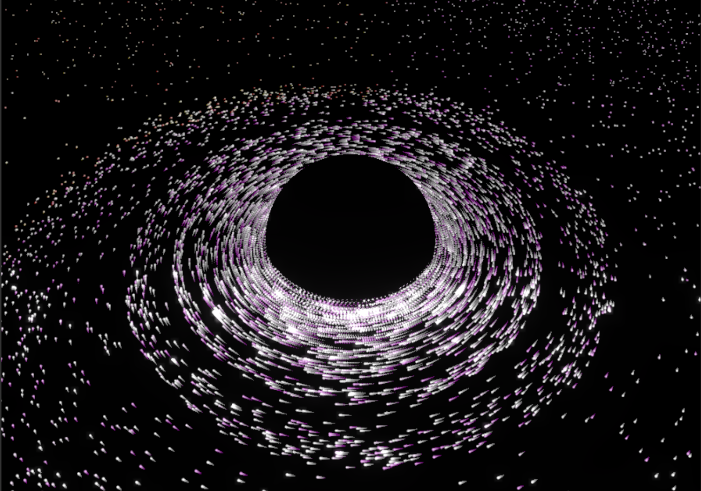

# intelligence.dev web site

This repository serves as the source for the intelligence.dev web site.

Currently it renders a visualization of a black hole in WebGL.

  <picture>
    <source media="(prefers-color-scheme: dark)" srcset="./public/img/the_eternal.png">
    
  </picture>

